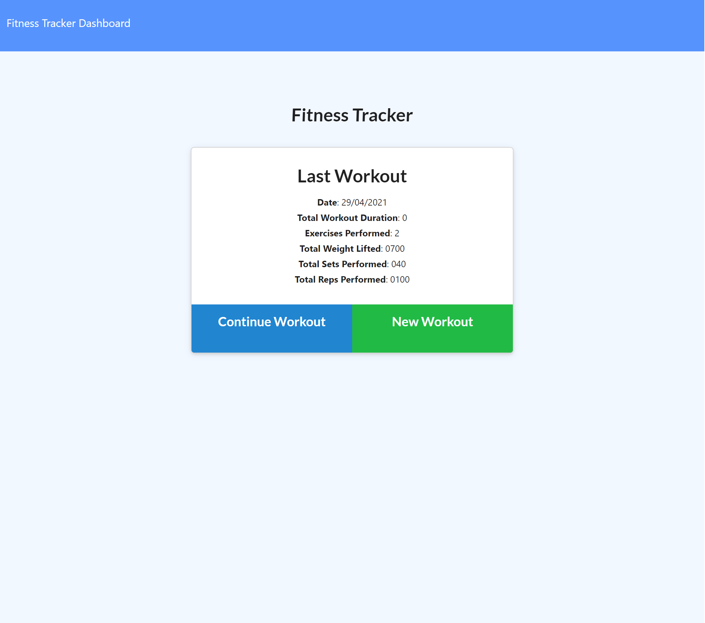

# Fitness-Tracker

  

## Table of Contents

- [Overview](#overview)
- [Technologies](#technologies-used)
- [Requirements](#requirements)
- [Questions](#questions)
- [License](#license)

## Overview
In this application, I have developed a program that allows users to keep track of their fitness.
Once the user has opened the webpage they may start adding workouts which will be aggregated as more is added in the index of the website.
---

## Technologies used
- MongoDB
- MongoDB Atlas
- Express
- NodeJS
- Javascript
---

## Requirements

The following list of requirements were derived from the project brief and considered when building this project allowing for the user to be able to:

 - Add exercises to the most recent workout plan.
 - Add new exercises to a new workout plan.
 - View the combined weight of multiple exercises from the past seven workouts on the `stats` page.
 - View the total duration of each workout from the past seven workouts on the `stats` page.

## Links:

1. Deployed : [HERE](https://travis297.github.io/Searchify/)
2. GitHub repo: [HERE](https://github.com/Travis-Witts/Fitness-Tracker)
---

## Screenshot of the app:

---
## Questions
    
If you have any more questions regarding this or any other projects contact me at my [GitHub](https://github.com/Travis297/), or [email](mailto:travis.witts@outlook.com).

---
## License
This project is licensed under the terms of MIT License.
